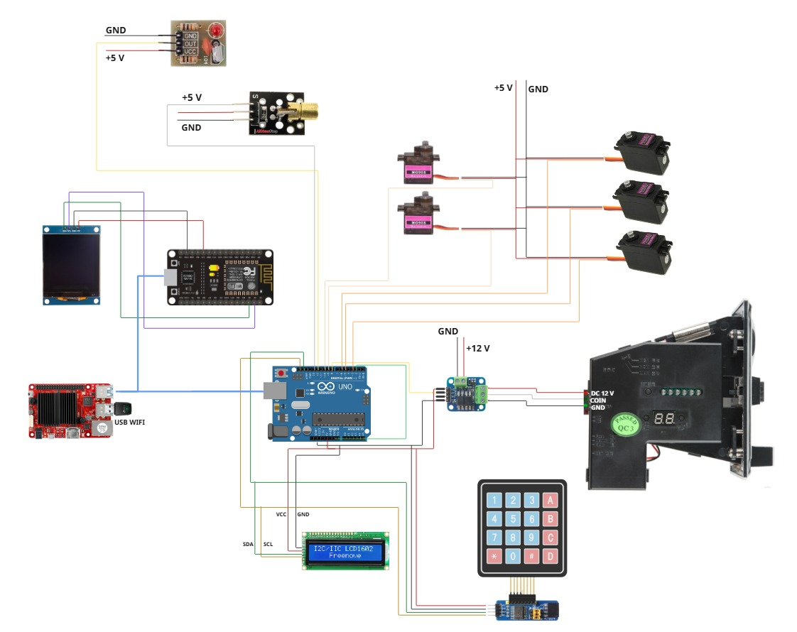
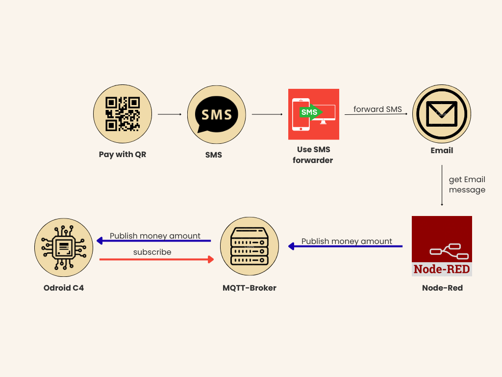
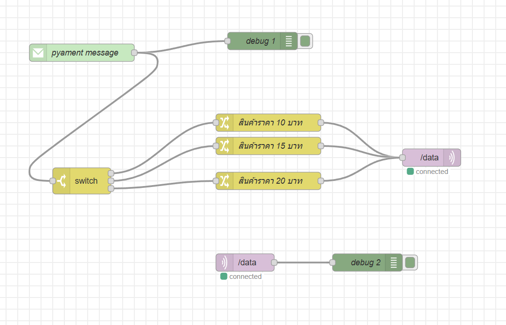
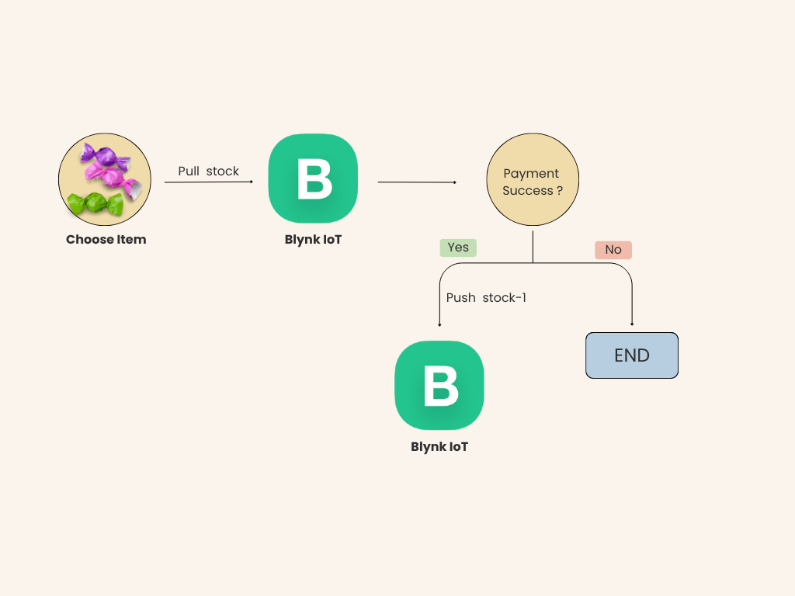
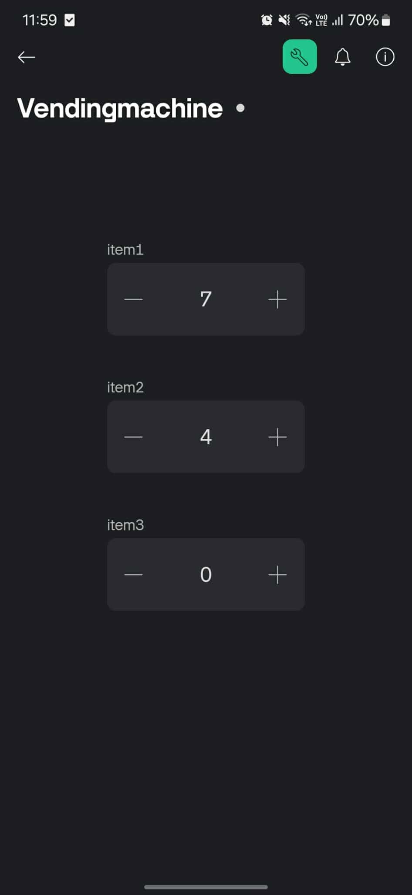
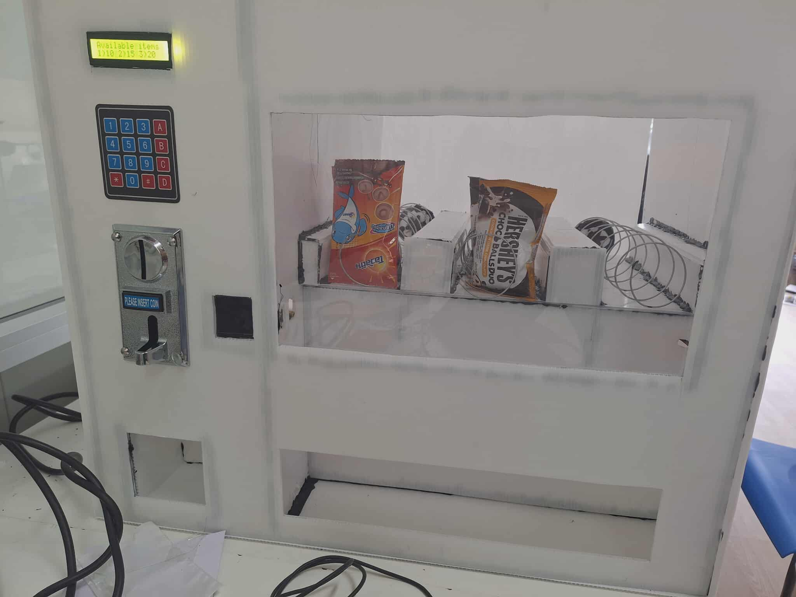
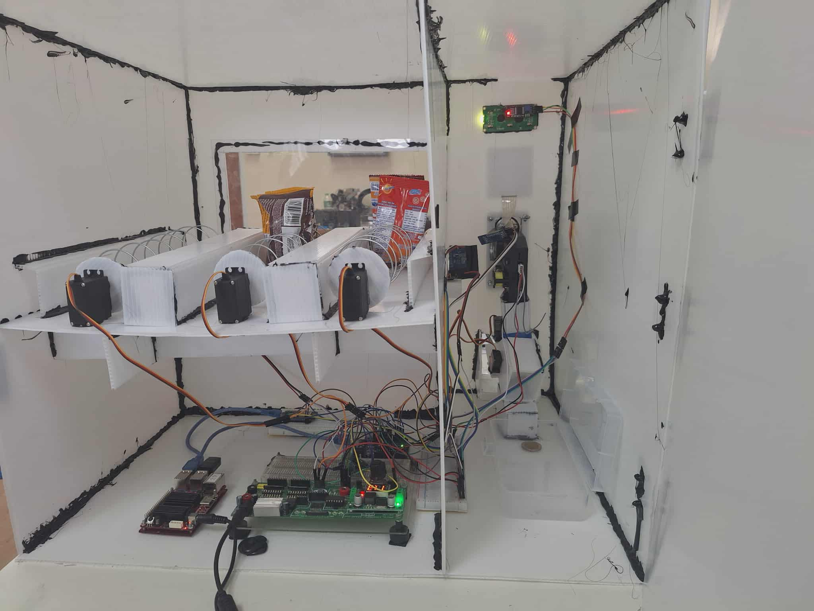

# Vending-Machine

This project implements a hybrid payment ecosystem (Physical Cash & Digital PromptPay QR Code) integrated with a centralized cloud database via the Blynk IoT platform for continuous telemetry, remote logging, and inventory tracking.

---

## Multi-Processor System Architecture

The core engineering of this system distributes structural workloads across three heterogeneous processing units to optimize scheduling, asynchronous networking, and hard real-time mechanical manipulation:

1. **Master Controller (Arduino Uno - ATmega328P):** Manages the execution loop, Finite State Machine (FSM) tracking, matrix keypad windowing algorithms, multi-coin acceptor interrupt pulse streams, logic verification, and electromechanical motor actuators.
2. **Peripheral Network Controller (NodeMCU ESP8266):** Interlinked as a dedicated display sub-driver over high-speed $400\text{ kHz}$ $\text{I}^2\text{C}$ bus lines, operating mathematical algorithms (`drawQR_centered`) to dynamically format dynamic hexadecimal strings onto a 1.5-inch SH1107 OLED matrix.
3. **Gateway Middleware Server (Odroid C4 - Amlogic S905X3):** Operates a persistent Python-based bridge controller daemon (`odroid.py`) linking asynchronous event queues with thread-safe remote procedure handlers (`paho-mqtt`) and live cloud database integration via REST API instances.

---

## Hardware Interconnection & Wiring Diagram

The diagram below details the structural interconnections, power distribution, and multi-bus communications running across the central computing layers:



*Figure: Complete hardware subsystem interconnection mapping the heterogeneous control loops between the Arduino Uno master core, NodeMCU OLED driver, and Odroid C4 gateway computing unit.*

---

## QR Payment Pipeline

To circumvent restrictive and costly bank-side Merchant API constraints, a transaction verification pipeline was engineered via a decoupled asynchronous microservice model:



### Data Ingestion Framework
* **Ingestion:** When a customer completes a transaction via the dynamic QR code string displayed on the screen, the transaction confirmation SMS from the commercial bank is immediately parsed by a mobile SMS forwarder tool.
* **Asynchronous Message Broker (Node-RED):** Node-RED continuously queries incoming IMAP mail streams via visual processing blocks, strips transaction strings, filters matching payloads ($10, 15, 20\text{ THB}$) via programmatic routing conditions, and publishes the valid state to an explicit queue topic (`/data`) hosted on a remote CloudAMQP instance.

### Node-RED Logic Routing Implementation
Below is the backend logic routing architecture implemented within Node-RED to parse transactional emails and dynamically map inbound monetary updates to respective stock units:



---

## Telemetry, Inventory Buffer & Cloud Synchronization

Central stock values mapping physical slots inside the Blynk IoT Cloud platform act as the single source of truth. Stock pulls are verified during state selection before confirming input logic to lock users out if stocks drop to $0$.

### Cloud Synchronization Flow Architecture
The diagram below details the structural execution sequence utilized to synchronize physical continuous inventory dispensing with remote virtual pin configurations:



* **Stock Request Lifecycle:** Upon physical item key selection, the master controller submits an external request to pull live datastreams (`V0` for Item 1, `V1` for Item 2, and `V2` for Item 3).
* **Transaction Latch Update:** Once an external payment confirmation state triggers success, the bridge engine automatically decrements the active cached vector integer by $1$ and pushes the structured update package back up to overwrite the server memory slots.

### Telemetry Management Interface
Administrator monitoring and manual replenishment are handled seamlessly via mobile and console dashboard layouts tracking live transaction logs:



---

## Core Technical Highlights

* **Hard Real-Time Mechanical Actuation & Fallback Protection:** Servomotors drive continuous-rotation worm-gear product coils. To guarantee positive delivery validation, an infrared laser transmitter module combined with a specialized high-sensitivity detector captures high-frequency beam cuts. The `dispenseItemBlocking_BEAM` logic enforces a precise hardware watchdog interrupt cycle—cutting engine torque immediately when a sample drop breaks the light barrier or forcing a generic timeout state after $11\text{ seconds}$ to protect mechanical drives.
* **Dual-Tier Coin Vault Handling Architecture:** Leverages a custom mechanical assembly comprising dual independent servomotors (`SERVO_TOP` & `SERVO_BOTTOM`) to handle coin segregation. Coins linger in an initial verification tray; on payment completion, `coinKeep` retracts the primary shutter, dropping funds into the long-term vault box. If a cancellation signal is caught (`#` key) or payment overages happen, `coinReturn` coordinates an explicit sequential release cycle—dropping exact customer coin sets back out into the bin.

---

## Physical System Implementation & Visual Media

Here is the completed, fully assembled hardware prototype of the standalone vending machine system:

| Front View (User Interface Area) | Back View (Internal Electromechanical Components) |
| :---: | :---: |
|  |  |
| *Figure: Front panel showcasing the LCD interface, matrix keypad, multi-coin acceptor, and dynamic OLED payment screen.* | *Figure: Internal chamber detailing the servo-driven continuous product dispensing coils and centralized processor mounting layer.* |

## Repository Structure

```text
├── src/
│   ├── UNO_project.ino      # Main FSM and mechanical control logic for Arduino Uno
│   ├── nodemcu_qrcode.ino   # OLED character-mapped QR engine code
│   ├── odroid.py            # Master script coordinating MQTT, Serial, and Blynk links
│   ├── lcd.h                # Enhanced I2C LCD character positioning libraries
│   └── keypad_pcf.h         # Matrix keypad window-filtering scan routines
└── images/
    ├── schematic.png        # Complete inter-IC wiring map and communication bus layout
    ├── front_view.jpg       # Physical hardware setup - front panel layout
    ├── back_view.jpg        # Physical hardware setup - internal electronics mount
    ├── QR_payment_process.png # Asynchronous FinTech payment sequence mapping
    ├── flow_node-RED.png    # Node-RED visual execution flow diagram
    ├── blynk_process.png    # Telemetry and cloud data synchronization flow
    └── blynk.png            # Mobile administration tracking terminal dashboard
